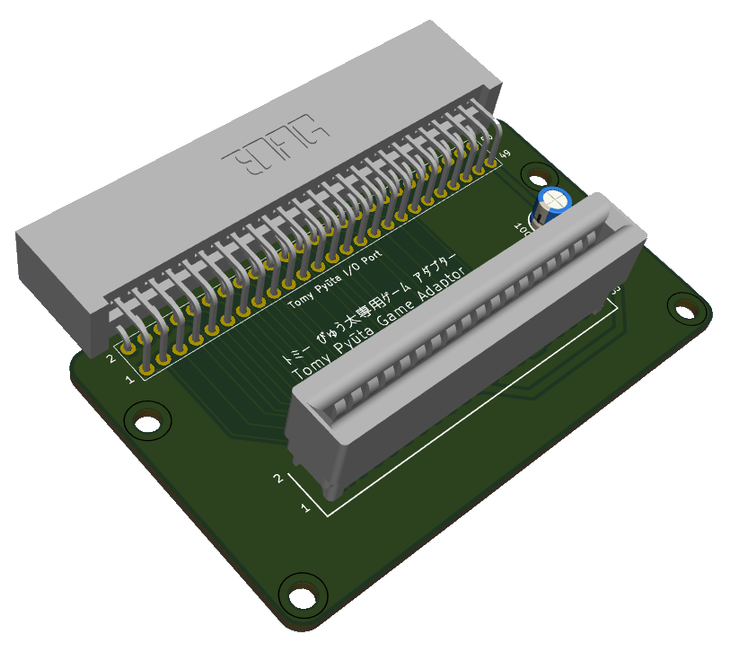

# Tomy Pyūta Game Adaptor (ぴゅう太専用ゲーム アダプター)

The Game Adaptor was designed to allow the original Tomy Pyūta (TP1000) to play 32KB cartridges designed for the Pyūta Mk II (TP1007) and Pyūta Jr. (TP2001). 

The adaptor is entirely passive, there are no active components ... although there is allocation for a 74LS00 and 74LS138, both unpopulated. 

The blurb from the box: 
> How To Use And Precautions
> 1. Insert it into the expansion port on the back of the ぴゅう太 unit.  The expansion port is covered with two screws, so remove the screws with a screwdriver and remove the cover.
> 2. First, insert the game cartridge marked with "*" into the cartridge slot on the top of the Game Adaptor.
> 3. With the cartridge still inserted, connect the Game Adaptor to the expansion port.  Make sure the power switch is in the OFF position when doing this.
> 4. After connecting correctly, turn the power switch on.
> 5. Please note that inserting or removing cartridges while the Game Adaptor is connected to the expansion port may cause damage.
>
> This adaptor is required when using game cartridges marked with a "*" on the ぴゅう太. 
> (For the ぴゅう太 Jr. or ぴゅう太 mkII, the Game Adaptor is not necessary)

It connects to the 50-pin I/O expansion port and provides a second 36-pin cartridge port that disables the internal ROM and adds some additional address lines. 

The 16KB cartridge ROM space is between 0x8000 and 0xBFFF. 

For a 32KB cartridge ROM, the lower 16KB maps to 0x8000-0xBFFF and the upper 16KB maps to 0x4000 to 0x7FFF.  This overlaps with the system ROM in the original ぴゅう太 and thus it has to be disabled for the 32KB cartridge to work. 

This is done by connecting cartridge pin 6 (J1-6p) to I/O port pin 35 (SELEXM) ... apparently. 

The Game Adaptor is not required on the Mk II or Jr. 

## Pinouts
### I/O Port
The signal names for the Tomy Pyūta.  Tomy Tutor names in brackets. 

| I/O Pin | Signal (Tutor)  |
|---------|-----------------|
| 1       | GND (0V)        |
| 2       | GND (0V)        |
| 3       | D7              |
| 4       | /INT1           |
| 5       | D6              |
| 6       | /HOLD           |
| 7       | D5              |
| 8       | A15             |
| 9       | D4              |
| 10      | A13             |
| 11      | D3              |
| 12      | A12             |
| 13      | D2              |
| 14      | A11             |
| 15      | D1              |
| 16      | A10             |
| 17      | D0              |
| 18      | A9              |
| 19      | /IOPORT (/E000) |
| 20      | A8              |
| 21      | /MEMEN          |
| 22      | A7              |
| 23      | A14             |
| 24      | A3              |
| 25      | A2              |
| 26      | A6              |
| 27      | /READY          |
| 28      | A5              |
| 29      | /DBIN           |
| 30      | A4              |
| 31      | /WE             |
| 32      | A1              |
| 33      | /INT4           |
| 34      | A0              |
| 35      | SELEXM (MEMORY) |
| 36      | ROMCLK (/0000)  |
| 37      | /RESET          |
| 38      | /EXP0 (GROMSEL) |
| 39      | /EXP1 (GROMCLK) |
| 40      | /EXP2 (/VDP)    |
| 41      | /EXP3 (/SOUND)  |
| 42      | /EXM00          |
| 43      | /EXM40          |
| 44      | /EXM80          |
| 45      | /EXMC0          |
| 46      | CLKOUT          |
| 47      | /IAQ (/CRUIN)   |
| 48      | KILLROM (-5VDC) |
| 49      | Vcc (+5V)       |
| 50      | Vcc (+5V)       |

## Cartridges
| Cartridge Pin | Signal (8/16KB) | Signal (32KB) |
|---------------|-----------------|---------------|
| 1             | GND             | GND           |
| 2             | GND             | GND           |
| 3             | D7              | D7            |
| 4             | N/C             | /RESET        |
| 5             | D6              | D6            |
| 6             | N/C             | J1-6p         |
| 7             | D5              | D5            |
| 8             | A15 CRUOUT      | A15 CRUOUT    |
| 9             | D4              | D4            |
| 10            | A13             | A13           |
| 11            | D3              | D3            |
| 12            | A12             | A12           |
| 13            | D2              | D2            |
| 14            | A11             | A11           |
| 15            | D1              | D1            |
| 16            | A10             | A10           |
| 17            | D0              | D0            |
| 18            | A9              | A9            |
| 19            | Vcc (+5V)       | Vcc (+5V)     |
| 20            | A8              | A8            |
| 21            | /CROM1          | /CROM1        |
| 22            | A7              | A7            |
| 23            | A14             | A14           |
| 24            | A3              | A3            |
| 25            | A2              | A2            |
| 26            | A6              | A6            |
| 27            | GROMCLK         | A1            |
| 28            | A5              | A5            |
| 29            | /DBIN           | /DBIN         |
| 30            | A4              | A4            |
| 31            | /WE /CPUCLK     | A0            |
| 32            | N/C             | /WE /CPUCLK   |
| 33            | N/C             | SOUND         |
| 34            | N/C             | /INT4 /EC     |
| 35            | /CROM0          | /CROM0        |
| 36            | N/C             | CRUIN         |

## Parts
These are the parts required - still to be tested (24/FEB/2026) ... it'll be a few weeks before I can get my hands on a Pyūta and Pyūta Mk II. 

- the PCB (obviously)
- a 100µF capacitor (for decoupling)
- a 50-pin edge connector for the I/O port (i.e. EDAC 395-050-559-201)
- a 36-pin edge connector for the cartridge (i.e. TE Connectivity 5530843-3)
